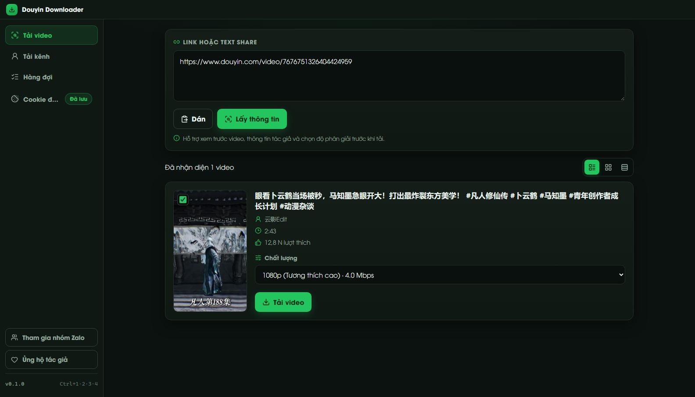
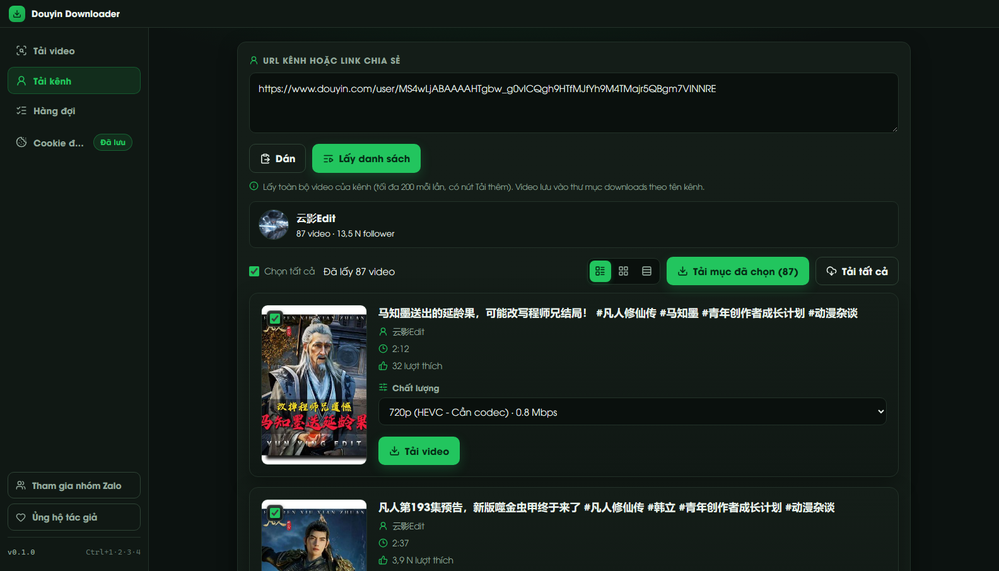
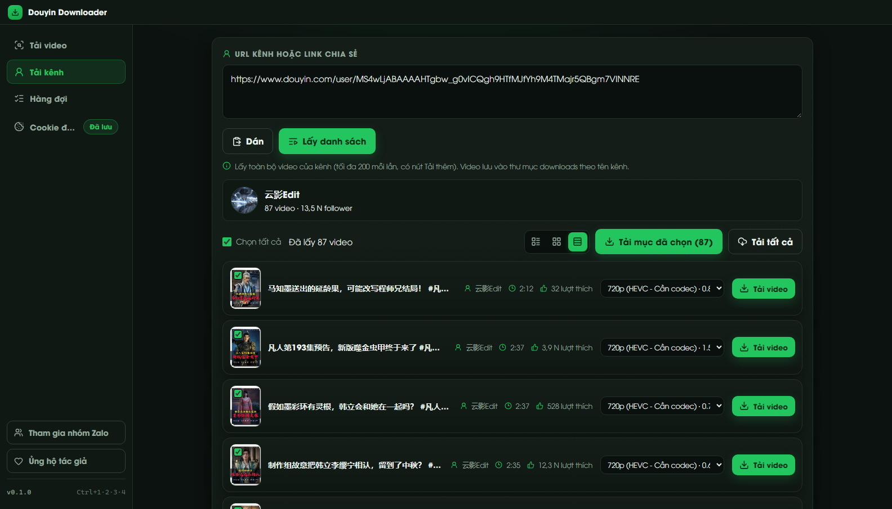

# Douyin Downloader

[](https://github.com/qu4nc0d3r/douyin-downloader/actions/workflows/test.yml)
[](LICENSE)
[](https://nodejs.org)

**English** · [Tiếng Việt](README.vi.md)

Local web app to download Douyin videos **without watermark** at the best quality available. Everything runs on your machine: a small Express server drives a headless Chrome/Edge instance that talks to Douyin's own web APIs — no third-party service, no account required.

> Not affiliated with Douyin or ByteDance. For personal use only — video copyright belongs to the original creators.

## Features

- **Single or batch links** — paste one or many links (or a whole share text). Up to 10 links per extraction, duplicates removed, per-link errors reported separately.
- **Channel bulk download** — paste a profile URL (`douyin.com/user/...`) or a `v.douyin.com` share link to list the channel's videos (up to `PROFILE_MAX_VIDEOS` per fetch, **Load more** for the rest), then pick videos and download them into `downloads/<channel>/`.
- **Queue tab** — add links without extracting first, then run them with a pipelined worker (extraction and downloads overlap).
- **Quality picker** — real resolution and bitrate labels (`2160p · 5.5 Mbps`); H.264 streams are preferred by default for maximum compatibility.
- **Pause / resume** — per video, plus **pause all / resume all** in every tab.
- **Resumable multi-connection downloads** — large files are split into chunks (IDM-style) with `.part` resume, retries and automatic CDN URL refresh when links expire.
- **Optional login cookie** — for private or age-restricted videos; stored locally in `data/cookie.json` only.
- **View modes** — list, grid and compact (more videos per screen).
- **Image posts** are detected and listed as unsupported — this tool downloads videos only.

## Requirements

- Node.js **>= 22**
- **Chrome or Edge** installed (auto-detected; override with `DOUYIN_BROWSER_PATH`)

Windows is the primary target; macOS and Linux work with a Chromium-based browser installed.

## Quick start

```bash
npm install
npm start
```

Open http://127.0.0.1:3030, paste your links and hit **Lấy thông tin** (Get info). The UI is in Vietnamese.

If a file already exists in `downloads/`, the app asks whether to overwrite it, create a new name (` (1)`) or cancel.

## Screenshots





## Login cookie (optional)

Some videos require a logged-in session. To provide one:

1. Install the **Get cookies.txt LOCALLY** extension in your browser
2. Log in to douyin.com, open the extension and export the cookies (Netscape `.txt` or JSON), or copy the header string
3. Open the **Cookie đăng nhập** tab in the app, paste the result and save

Supported formats: Netscape `cookies.txt` (including `#HttpOnly_` lines), JSON exports, header strings, `Copy as cURL` and raw `a=b; c=d` pairs.

Only login cookies (`sessionid`, `sid_tt`, `uid_tt`, …) are forwarded to the hidden browser; fingerprint cookies (`ttwid`, `UIFID`, `s_v_web_id`, …) are ignored so the site's request signing keeps working. Cookies stay in `data/cookie.json` on your machine and are only sent to Douyin.

## How it works

1. Links are parsed from the pasted text; short links are resolved to an `aweme_id`
2. A headless Chrome/Edge instance starts with a temporary profile and opens `douyin.com`
3. Douyin's web APIs are called **from inside the page context**, so the site's own SDK signs the requests — no signature reverse engineering
4. Streams are picked from `video.play_addr` (watermark-free) and `video.bit_rate` (quality tiers)
5. Files stream to `downloads/` with URL fallbacks, stall detection and resume support

The first extraction takes ~5–10 seconds while the hidden browser boots; later requests reuse it.

## Configuration

All variables are optional (see `.env.example`):

| Variable | Default | Description |
|---|---|---|
| `PORT` | 3030 | Server port |
| `MAX_CONCURRENT_DOWNLOADS` | 2 | Maximum parallel download jobs |
| `SEGMENT_MIN_SIZE` | 83886080 (80 MB) | Files above this size use multi-connection download; `0` disables |
| `SEGMENTS` | 8 | Maximum connections per large file |
| `CHUNK_SIZE` | 16777216 (16 MB) | Chunk size for segmented downloads |
| `STALL_TIMEOUT_MS` | 30000 | Abort a connection that receives no bytes for this long |
| `DOWNLOAD_RETRIES` | 2 | Retries per CDN URL |
| `DOUYIN_BROWSER_PATH` | auto-detect | Path to Chrome/Edge |
| `BROWSER_IDLE_TIMEOUT_MS` | 120000 | Shut the hidden browser down after this idle time |
| `PROFILE_MAX_VIDEOS` | 200 | Videos fetched per channel request (the UI offers **Load more**) |
| `CLOUDFLARE_WORKER_URL` | — | Optional edge cache for video metadata (see `cloudflare-worker/`) |
| `CLOUDFLARE_WORKER_SECRET` | — | Shared secret for the worker |

## Testing

```bash
npm test
```

Unit tests run fully offline (the browser and network tests are skipped unless opted in):

```powershell
$env:RUN_NETWORK_TESTS=1; $env:TEST_DOUYIN_URL="https://www.douyin.com/video/xxxx"; npm test
```

## Project layout

```
server.js             Express entry point
src/browser.js        Headless Chrome/Edge over CDP
src/extractor.js      Link parsing, metadata parsing, pure helpers
src/downloader.js     Streaming downloads + retries + URL refresh
src/segmented.js      Chunked (IDM-style) download planner
src/app.js            Express app factory (routes, job queue, SSE)
public/               Vanilla JS frontend (no build step)
cloudflare-worker/    Optional edge cache worker
electron/             Optional desktop shell
test/                 node:test suites (offline by default)
```

## Disclaimer

- Personal use only. Copyright of the downloaded videos belongs to their creators.
- Douyin changes its APIs without notice. If extraction breaks, check `src/browser.js` (endpoints/params) and `src/extractor.js` (`parseAwemeDetail`).
- The app never sends your data anywhere: cookies and downloads stay on your machine.

## License

[MIT](LICENSE)

## Credits

- [Lucide](https://lucide.dev) icons (ISC license)
- **UTM Avo** font — Vietnamese-optimized by Đinh Kiên (free for personal use)
